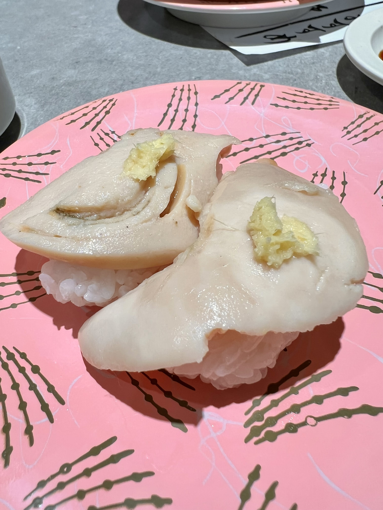

寿司を食べずに北海道を去ることはできぬ

写真の下はにしん
北海道の網走産
春告魚とも言われるぐらいの暖かい時期が旬の魚
しかし、産卵前の冬の時期には身に油が乗っていて美味い
美味かった
そのかわり数の子は取れない

上はあぶらがれい
こちらも北海道の羅臼産
旬は秋から冬らしい
めっちゃ美味い
あたしゃこれが大好物でして
来たら必ず食べる
𝑻𝒉𝒆 𝑩𝒆𝒔𝒕 𝒐𝒇 𝑺𝒖𝒔𝒉𝒊の称号は君のものだ

他に珍しいものだとホタテの白子
初めて見た
なんとも言えぬうまみ
おいしかった

他には切り落とし軍艦もすき
余った切れ端がわちゃってなって乗ってる
毎回ランダムで楽しい
たまに高いネタとかが出てくると嬉しい

もちろん白子の軍艦も食べた
これを食べなきゃ冬を越せない

明日からはダイエットと卒論を頑張るぞ
