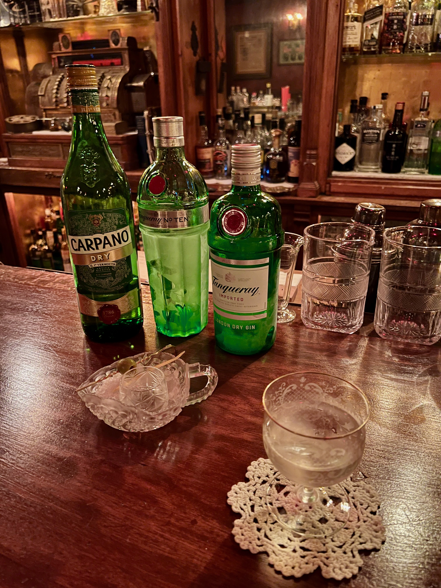
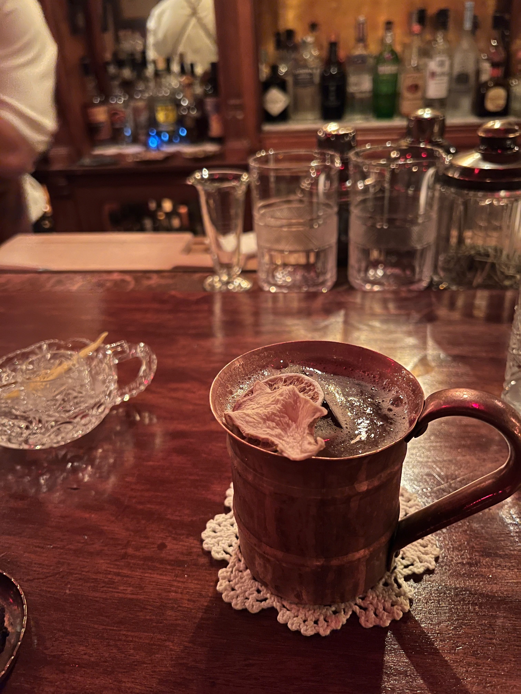

すごいバーが大阪心斎橋にあった
使われている食器とか，机とか，椅子とか，床とか，ネジ一本まで，正真正銘，禁酒法時代の100年前のアメリカのもの
トイレも古いものでびっくりした
入り口の階段とかドアもその時代の木材らしい
禁酒法時代の潜り酒場をコンセプトにとか言いながらここまでするのだからびっくり
地下への入り口も隠れている

まずいただいたのはマティーニ，2種類のジンを使って飲み比べできるようにしてくれる

続いてモスコミュール
この店オリジナル，ある野菜がウォッカに漬け込まれていてその味がする
びっくりしたけど，意外と合う
美味しかった

スマホの電波も通らない，地下のお店
ほんとに異世界にきたような，タイムスリップしたような気分だった
店から出て難波のガヤガヤした街に急に戻ったら思わず笑ってしまった

日本だとここでしか飲めないウイスキーもあるとか
おすすめです
