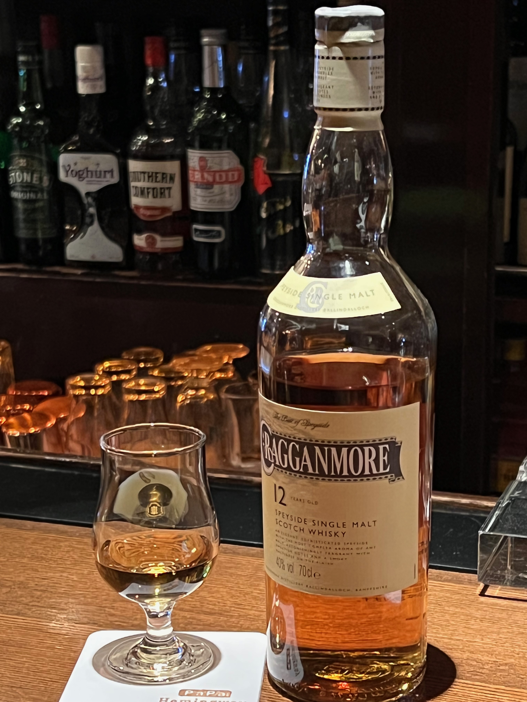
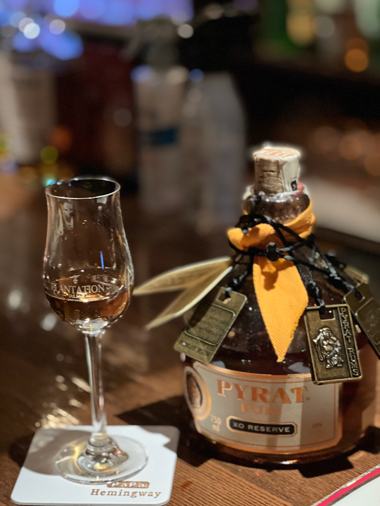
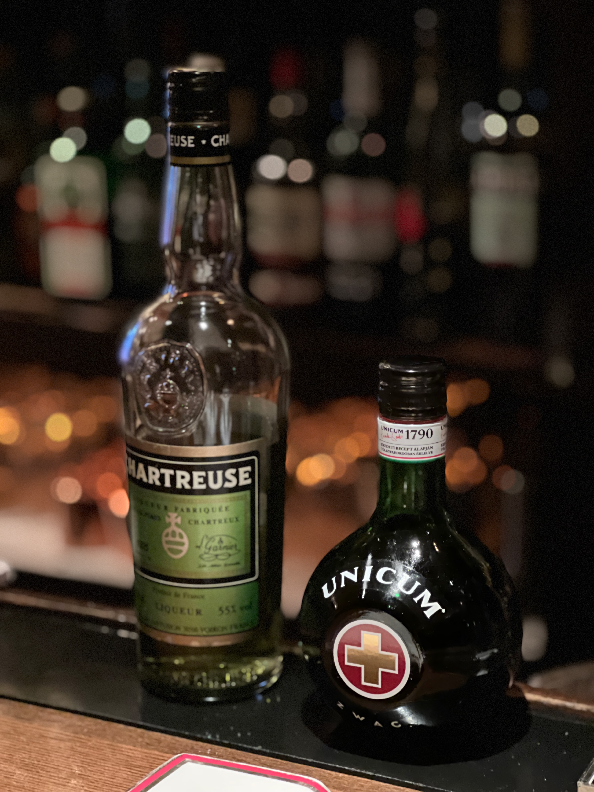

1/11，本日は「最強の吉日」らしい
新しいこととかを始めるといいとか
というわけで葉巻を吸いに行ってみました

画像はキューバのやつ
かなり味は濃い方だそうで
ドミニカのとかはもっと軽い味わいと聞いた

お酒は葉巻に合うとおすすめしていただいたこちら

クラガンモア12年
スペイサイドの甘めのウイスキー
葉巻には基本的には甘めが合うと教えてもらった

そんでもって葉巻とウイスキーめっちゃ合う
ウイスキーが何倍にも美味しくなる気がする
ハードリカー類甘党の方は是非

そしてもう一つ

PYRATというラム，パイレーツというようだ
飲むヨーグルトみたいな，こちらもすごく甘くて美味しいお酒
葉巻は後半になるにつれて辛く味が変化してゆく
なのでより甘いお酒はとても良くあう
布袋様のお酒らしい，ふだがついている，とても縁起がよろしい
BOØWYではない

他にも薬草系でおすすめしていただいたもの
試飲でいただいた

甘いね！
左のやつの方が甘い
ちょっと葉巻は負けちゃうかも
ソーダで割っても美味しいと言っていた

他にも葉巻を家で吸う時は400円ぐらいのからあると教えてくれた
5本で1000見たいのはだめ
フレーバー付きのやつもいまいちらしい

あと大事なのが葉巻は擦り付けて消さないこと
そのお店に二度とくるかという意味合いがあるらしい
マナーだね
自然に消えるのを待つ

他にも面白い話をたくさん聞いた
葉巻のラベルはイギリスではすぐ剥がす
アメリカではなるべく短くなってから剥がす
「俺はこんなにいいの吸ってんだぞ」ってのを周りにアピールする意味があると
イギリスでは嫌われる，アメリカでは好まれる

葉巻は持てるギリギリまで吸おう
成仏できます

とても楽しかった
卒論に詰まったらまたリラックスしにきてねって
もう詰まりまくっております
