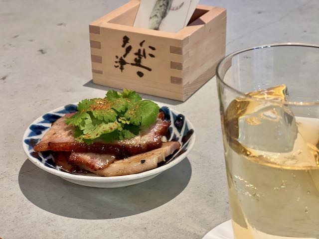

散歩をしていると、新しいお店を見つけることがある
今日は新しい酒屋さんを見つけた
愛媛や四国の日本酒に詳しいようだ
ワインも多い、店長さんはソムリエらしい
ウイスキーはそんなに多くないけど、復刻版角瓶を売っていた

角打ちもやっている
この近くの商店街や飲食店のものをおつまみとして出している
復刻版角瓶のハイボールと、すぐ近くの精肉店の焼き豚と
焼き豚、美味しい
近所再発見
地元密着なお店っていいな
