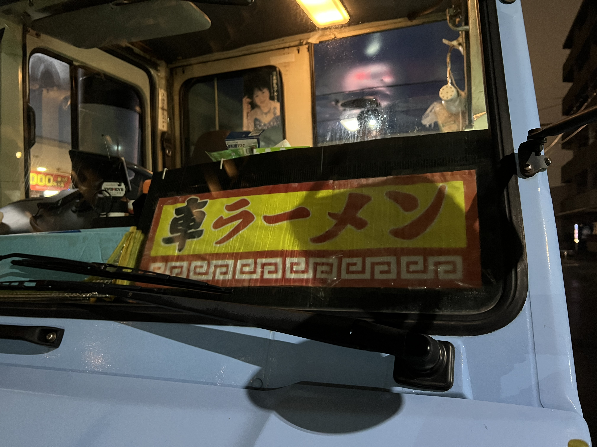

紅白の梅の花が大変見事に咲いていた
今日は雨の日だったけど、いいものを見れた
なんかめでたい気がした

めでたいといえば、本物のチャルメラに遭遇した
家の中で微かにその音が聞こえた時耳を疑った
令和の時代にチャルメラでラーメンなんて

すぐに家を飛び出した
音の鳴る方へ少しづつ探って近づいていく
見つけた！あれがチャルメラの正体
テイクアウト形式、つい買ってしまった

味は懐かしい感じのする醤油ラーメン
とても美味しかった
紅白梅、めでたいな
