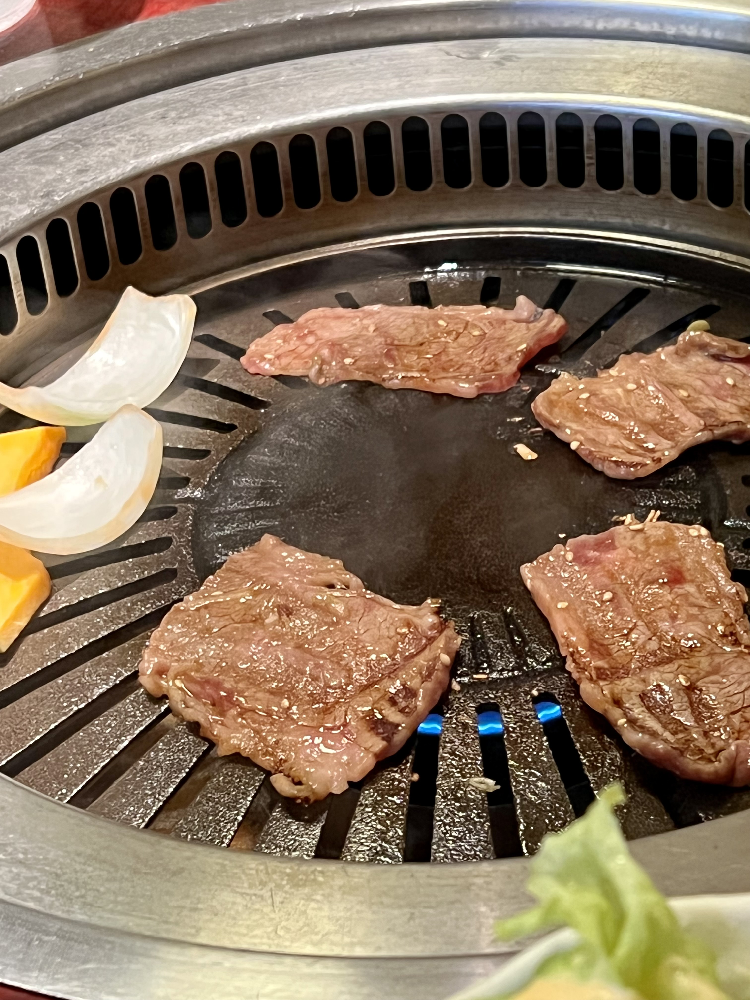
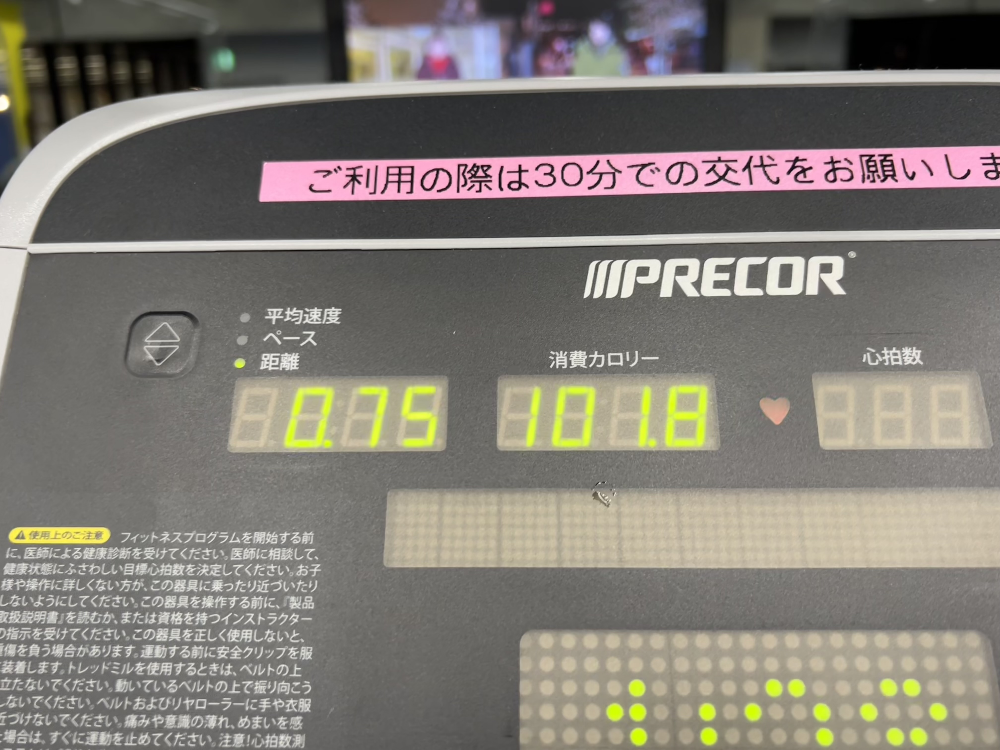

高えパンは美味い
これはグランドホテルでもらったパン
たくさんバターーーー
マシュマロみたいにやわらかい
信じられねえ、焼いたのに
甘くていくらでも食べられる

焼肉
美味い
脂身万歳
カルビとジンギスカン二種盛り
ジンギスカンは高い肉の方が赤身が多く臭みも少ない
安い肉は脂身もあってちょっとクセがある
実は安い肉の方がうまい
脂身に旨味が詰まってる
くさみも旨味
高い肉は高いくせにパサついてるし

カロリー
チェンソーマンでも呪術廻戦でもカロリーの魔神はだいぶ強いとおもう
ジムへ行って倒してきました

