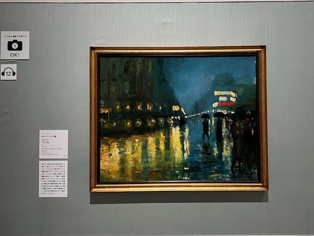

今日は、そうだな、たくさん動いた
まずなにをしたかってラーメン
次に鶴橋を散歩して
最後に美術館
目次だ

ラーメン美味しかった
ちょっと遠いから2度め行きたいけどどうかなー
値段はするけどちゃんと凝ってるし
塩ラーメン食べた
醤油も食べたいね

鶴橋
ラーメン屋さんの腹ごなしにしばらく歩いてたら着いた
すごい街だ
大阪屈指の迷路商店街と言われるのも納得
そして暗い、九龍城ってこんな感じだったのかな
さらにカオスを極めてほしい
個人的には好きな街だった

美術館
あべのハルカス
イスラエル博物館所蔵 印象派・光の系譜
とても良かった
バルビゾン派から印象派の風景画が好きなのでドンピシャの楽しい展覧会だった
レッサー・ユリイ「夜のポツダム広場」
めちゃ好きでした
いくつか写真を撮ってもいいよって言う絵があって、これがその一枚だったのも嬉しいポイント

今日はたくさん動き回ってたくさん写真を撮った
今日の一枚をどれにするか迷ったけど
美術館横の展望台から撮った大阪の街並みで総括
だいぶあったかくなってきたなー

ようやく元気が出て色々できるようになってきた
まだまだ空元気だけど
色々やると、人に迷惑をかけたり、嫌われたりすることもあると思う
適度に反省しつつ、しすぎないようにしつつ
模索を続けながら突っ走っていきたい
いつかちゃんと無理せず歩みを進められるように
