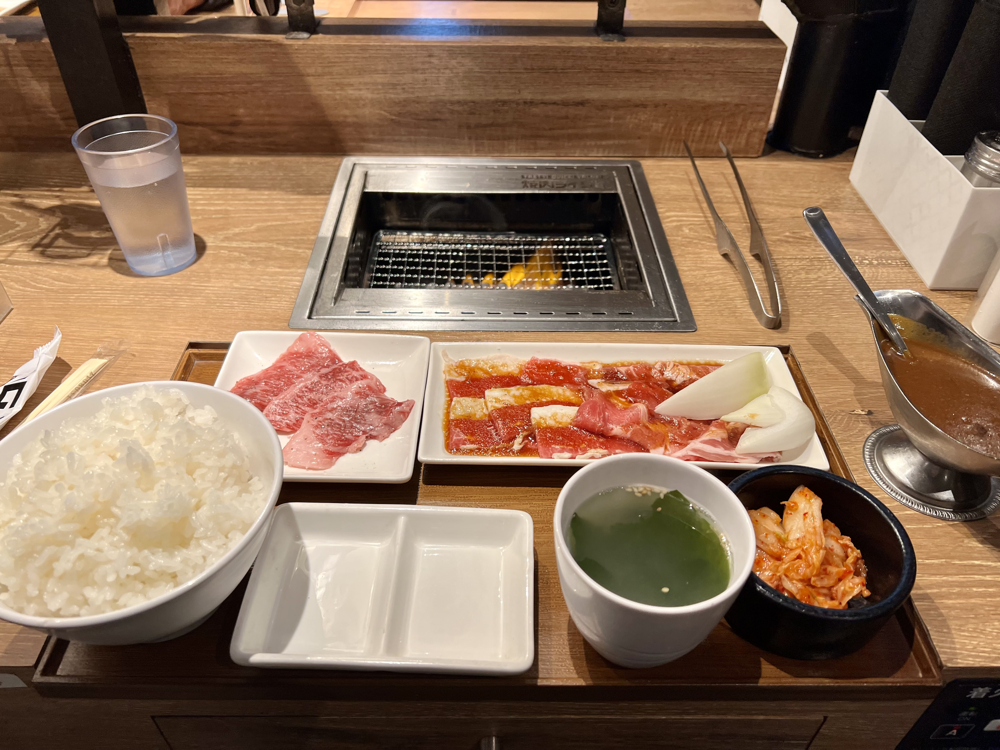

## この文章は睡眠薬を飲みながら書きました

いこうと思ってた店が閉まっていた
チャーハンをオムライスにして巻いてカレーをかける
いかにも小学生の夢が詰まったような調理が名物のようだ
私も小学生とそう変わらないと信じている間に早く再開してほしい
今日のお昼ご飯がここでなくなった
そういえば今日は肉の日だ

焼肉ライクには学割という大変ありがたいものがある
カレーと肉100gとキムチとスープがついて550円
しかもご飯おかわりが自由なのだ
濃いめのタレ、ご飯が無限に溶けていく、大盛りご飯でカレーを食い尽くす、おかわり普通ライスでキムチを食い尽くす、おかわり無料ご飯超大盛で肉を制す
この世の幸せの中で一番だと思う、カレー、キムチ、旨辛タレ、ニンニク、そして肉、ご飯に合うすべてが集まっているワールドカップ
僅か少しの間だけでも、おかわり無限無料は不安定な僕らの将来の不安を忘れさせてくれる
誰か今度一緒ににいきましょう、お酒飲み放題もあるみたいです、どんな無理をしてでも予定を合わせます

三宮にはもう一つ、美味しいステーキが食べれて、550円で、ご飯おかわり自由な店がある
こんなに嬉しいことはない、春日野道に住んでいてよかった
行きたかったらぼくも行くのでいつでも誘ってください
連れて行きますよ自称三宮のプロ（？）
基本ランチ時間帯なのでお気をつけください
デブの皆さん待ってるぜ

そういえば昨日レバニラ炒めを食べた、王将だけど
レバーが主役かと思えば、ニラともやしだけでも十分うまい、また違う美味しさがある
もちろんレバーがあってもとても美味しいのだが、あえての野菜だけの美味しさに気づけた自分がうれしかった
味はマリアージュ。一瞬で爆発して、好き嫌いを吹き飛ばす新たな発見。
実は餃子も追加注文した、最近餃子にタルタルソースにタバスコ乗せて食べるのにはまってる
ガチで決まる。タルタルタバスコ。おすすめです。

難波のビル群のように、脳を貫通する5Gアンテナの、放出するプリアンブルが256QAMの面で俺に巻きつく
泥酔した大人は俺らに身を任せて、ハッピーは自分で受信する＿＿
信じることができる人間はいない。振り払え、道化を演じる大人たちよ

死にたい

無気力と不安があった、それぞれがそれそれを悪く刺激しあっていた、負のスパイラル
最近不安が薄れてきた、たまに復活するけど、薬のおかげで抑えられている
無気力しかない時、自分は何をすればいい
何も考えられない、lim 極限まで0にちかづけている、正の壁を越える鍵は何？
無気力は疲れない一日中寝ているだけ
越えないといけない壁、勇気を出したい

おれは何ができる？他人にはできて、自分にはできない、この壁は一体何？もう越えられないのか？
自分のやりたいことは何？何に嫉妬している？
おれもみんなみたいに幸せになりたい

バイクの運転は少しできるようになってきた、グラディウスが可愛い
ゲーム漫画アニメにたいな新しいコンテンツにふれたり、
新しいゲームをやるのはまだ苦手
研究をすっぽかすことを目標にしたい
